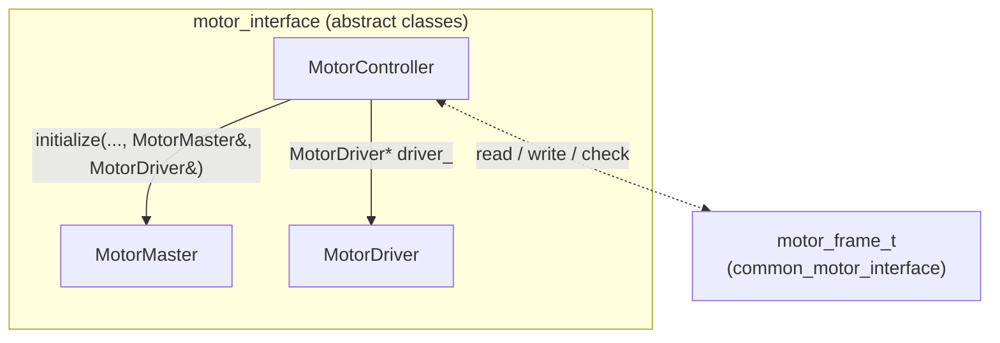

# motor_interface

C++ motor abstraction headers (`ament_cmake`). Namespace: `motor_interface`. Command/status payloads use `motor_frame_t` from `common_motor_interface/motor_frame.hpp`.

## Class relationship graph

Solid arrows: compile-time / structural ties in the headers. Dashed: payload type exchanged by `MotorController` (not owned by these classes).

At runtime, concrete `MotorController::initialize` receives the specific `MotorMaster` and `MotorDriver` instances (e.g. EtherCAT + vendor driver); the controller maps `motor_frame_t` to process data using the driver’s `entry_table_t` layout.

---

## `include/motor_interface/motor_master.hpp`

### Classes

- **`MotorMaster`** — Abstract fieldbus master: activation, cyclic exchange, distributed-clock hooks. Constructed from **`master_config_t`**.

### Structs

#### `master_config_t`

| Field | Type | Meaning |
|-------|------|---------|
| `id` | `uint8_t` | Master instance id (YAML `masters[].id`). |
| `number_of_slaves` | `uint8_t` | Slave count on this master. |
| `master_index` | `unsigned int` | IgH EtherCAT master index (EtherCAT implementations). |

---

## `include/motor_interface/motor_controller.hpp`

Depends on `motor_master.hpp`, `motor_driver.hpp`, and `common_motor_interface/motor_frame.hpp`.

### Classes

- **`MotorController`** — Abstract per-slave bridge: ties one **`MotorMaster`** and one **`MotorDriver`** after `initialize`, maps **`motor_frame_t`** ↔ PDOs using the driver’s **`entry_table_t`** layout and **`DriverState`**. Constructed from **`slave_config_t`**.

### Structs

#### `slave_config_t`

| Field | Type | Meaning |
|-------|------|---------|
| `controller_index` | `uint8_t` | Dense index in `MotorManager` controller array. |
| `master_id` | `uint8_t` | Owning `MotorMaster` id. |
| `driver_id` | `uint8_t` | `MotorDriver` id for PDO mapping / scaling. |
| `alias` | `uint16_t` | EtherCAT alias. |
| `position` | `uint16_t` | EtherCAT ring position. |
| `vendor_id` | `uint32_t` | Slave vendor id. |
| `product_id` | `uint32_t` | Slave product code. |

---

## `include/motor_interface/motor_driver.hpp`

### Classes

- **`MotorDriver`** — Abstract vendor driver: PDO / SDO tables (**`entry_table_t`**), scaling, CiA402-style enable sequencing (**`DriverState`**). Constructed from **`driver_config_t`**.

### Structs

#### `driver_config_t`

| Field | Type | Meaning |
|-------|------|---------|
| `id` | `uint8_t` | Driver instance id. |
| `pulse_per_revolution` | `uint32_t` | Encoder pulses per revolution (scaling). |
| `rated_torque` | `double` | Rated torque (Nm, datasheet). |
| `unit_torque` | `double` | Raw unit ↔ Nm scale. |
| `lower` | `double` | Position/command lower limit. |
| `upper` | `double` | Upper limit. |
| `speed` | `double` | Speed limit / profile parameter. |
| `acceleration` | `double` | Acceleration limit. |
| `deceleration` | `double` | Deceleration limit. |
| `profile_velocity` | `double` | Profile velocity. |
| `profile_acceleration` | `double` | Profile acceleration. |
| `profile_deceleration` | `double` | Profile deceleration. |

#### `entry_table_t`

| Field | Type | Meaning |
|-------|------|---------|
| `id` | `uint8_t` | Semantic id (see **Variables** below). |
| `index` | `uint16_t` | CANopen / object dictionary index. |
| `subindex` | `uint8_t` | Subindex. |
| `type` | `DataType` | `U8` … `S32`. |
| `size` | `uint8_t` | Payload size in bytes (≤ `MAX_DATA_SIZE`). |
| `data` | `uint8_t[MAX_DATA_SIZE]` | Little-endian raw buffer. |

### Enums

#### `DataType`

`U8`, `U16`, `U32`, `U64`, `S8`, `S16`, `S32` — used in `entry_table_t` and YAML parameter files.

#### `DriverState`

`SwitchOnDisabled`, `ReadyToSwitchOn`, `SwitchedOn`, `OperationEnabled` — CiA402-style enable sequencing (`MotorController` tracks `current_driver_state_`).

### Functions

| Name | Notes |
|------|--------|
| `DataType toDataType(const std::string& type)` | Parses `"u8"` … `"s32"`; throws `std::runtime_error` if invalid. |
| `template <typename T> T value(const uint8_t* data)` | Little-endian decode from `data` (size `sizeof(T)`). |
| `template <typename T> void fill(const T& value, uint8_t* data)` | Little-endian encode into `data`. |

### Variables

`inline constexpr` limits:

| Name | Value | Meaning |
|------|-------|---------|
| `MAX_DATA_SIZE` | `4` | Max bytes in `entry_table_t::data`. |
| `MAX_ITEM_SIZE` | `32` | Max `items_` entries. |

Semantic entry `id` constants (for `entry_table_t::id`):

| Constant | Value | Typical role |
|----------|-------|----------------|
| `ID_CONTROLWORD` | 0 | CiA402 controlword |
| `ID_TARGET_POSITION` | 1 | Target position |
| `ID_TARGET_VELOCITY` | 2 | Target velocity |
| `ID_TARGET_TORQUE` | 3 | Target torque |
| `ID_STATUSWORD` | 4 | Statusword |
| `ID_ERRORCODE` | 5 | Error code |
| `ID_CURRENT_POSITION` | 6 | Actual position |
| `ID_CURRENT_VELOCITY` | 7 | Actual velocity |
| `ID_CURRENT_TORQUE` | 8 | Actual torque |
