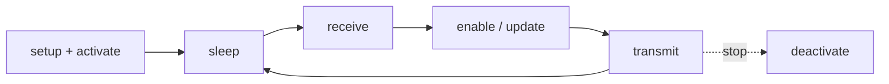
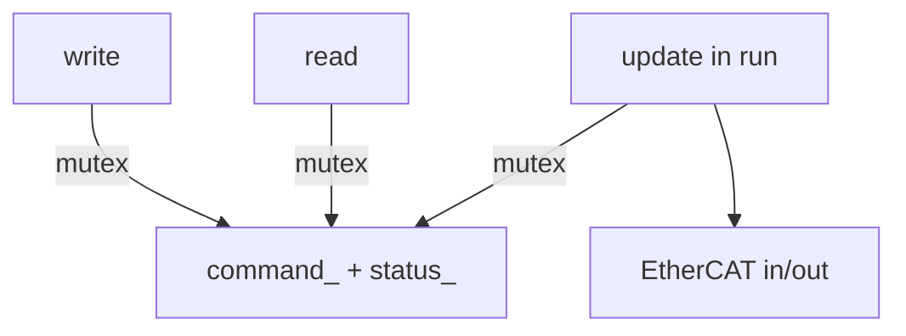

# motor_manager (library)

`MotorManager` — **`run()`**, **`write()`**, **`read()`** over `motor_frame_t` (`include/motor_manager/motor_manager.hpp`).

---

## `run()`

`request_stop()` ends the loop; then masters deactivate and memory is unlocked.

---

## `write()` · `read()` · `update()`

- **`write()`** / **`read()`**: other thread; only copy under **`frame_mutex_`** (plus **`is_command_changed_`** on write path).
- **`update()`**: inside **`run()`**; refreshes **`status_`**, may push **`command_`** to the domain after **`receive`**.
