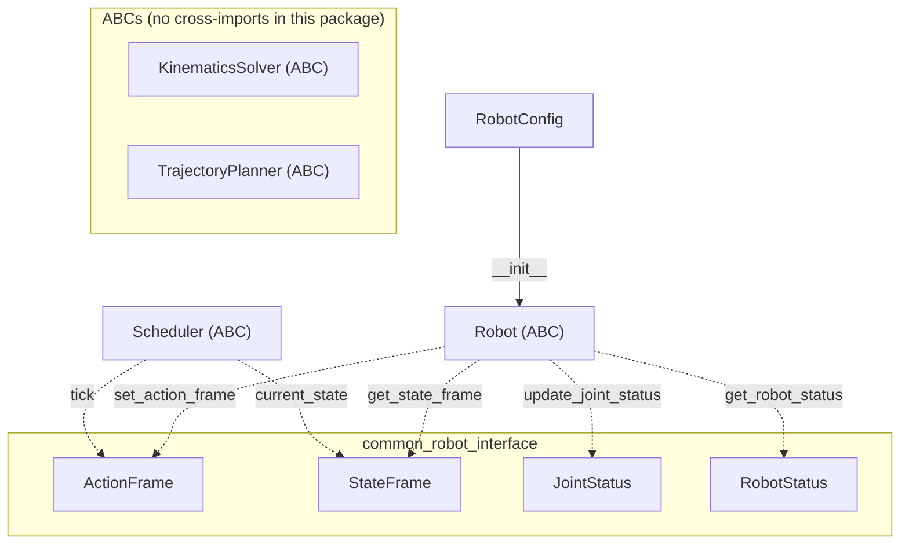
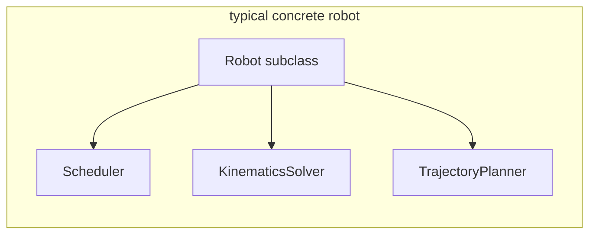

# robot_interface

Python robot abstractions (`ament_python`). Package `src/robot_interface/`. Shared message-style types (`ActionFrame`, `StateFrame`, `JointStatus`, `RobotStatus`) live in **`common_robot_interface`**.

## Class relationship graph

Solid: construction. Dotted: types passed through or held as state at the abstract API boundary.

`KinematicsSolver` and `TrajectoryPlanner` are not referenced from `Robot` or `Scheduler` in this package; concrete robots (e.g. in **`robots/`**) compose them alongside **`Robot`** and **`Scheduler`**.

---

## `src/robot_interface/robot.py`

### `RobotConfig` (dataclass)

| Field | Type | Default | Meaning |
|-------|------|---------|---------|
| `robot_id` | `int` | `0` | Logical robot id. |
| `dt` | `float` | `0.01` | Control period (s). |
| `stride_length` | `float` | `0.0` | Nominal stride (m-class). |
| `clearance` | `float` | `0.05` | Foot / body clearance for planners. |
| `duration` | `float` | `5.0` | Default action duration (s). |
| `controller_indexes` | `Any` | empty `int32` 1D | Global motor indices. |
| `interface_ids` | `Any` | empty `int32` 1D | Interface ids per motor. |
| `home_joint_positions` | `Any` | empty `float64` 1D | Home joint vector. |
| `home_pose` | `Any` | `zeros(6)` | Home pose `x,y,z,R,P,Y`. |

### `Robot` (ABC)

See **Class relationship graph** above.

---

## `src/robot_interface/scheduler.py`

### `Scheduler` (ABC)

See **Class relationship graph** above.

---

## `src/robot_interface/kinematics_solver.py`

### `KinematicsSolver` (ABC)

See **Class relationship graph** above.

### Static helpers (on `KinematicsSolver`)

| Function | Role |
|----------|------|
| `_get_pose_transformation_matrix` | \(4\times4\) pose from `[x,y,z,R,P,Y]`. |
| `_invert_pose_transformation_matrix` | Inverse world–body transform. |
| `_get_transformation_matrix` | One DH row \([a,\alpha,d,\theta]\) → \(4\times4\). |
| `_forward_kinematics` | Chain DH → foot position \((3,)\). |

---

## `src/robot_interface/planner.py`

### `TrajectoryPlanner` (ABC)

See **Class relationship graph** above.

### Static helpers (on `TrajectoryPlanner`)

| Function | Role |
|----------|------|
| `_quintic_time_scaling` | Smooth \(s \in [0,1]\) easing. |
| `_parabolic_time_scaling` | Bump \(4s(1-s)\). |

---

## `src/robot_interface/__init__.py`

Re-exports **`Robot`**, **`RobotConfig`** only. Other ABCs are imported from their modules in **`scheduler`**, **`kinematics`**, **`planner`**, **`robots`**.
