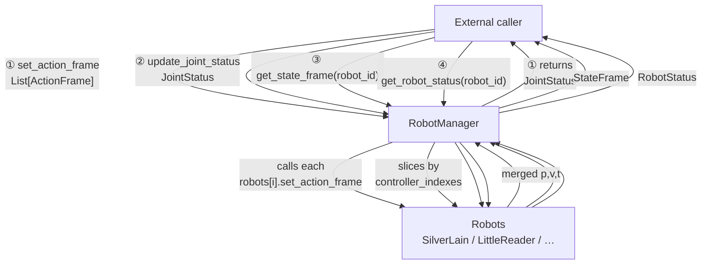

# robot_manager (package)

**`RobotManager`** connects an **external caller** to **`Robot`** instances (`src/robot_manager/robot_manager.py`).

① **Commands:** `ActionFrame` list → `RobotManager` → each `Robot` → merged **`JointStatus`**.  
② **Feedback:** global **`JointStatus`** → sliced → each **`Robot`**.  
③ **`StateFrame`** / ④ **`RobotStatus`:** `robot_id` query via `RobotManager` → chosen **`Robot`**.
